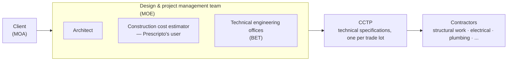
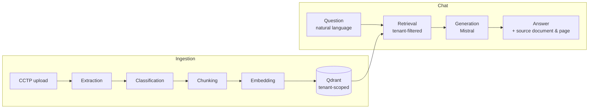

# Prescripto

Prescripto is an intelligent document management system built for construction
cost estimators working with CCTP files — technical specification documents
that routinely run several hundred pages and cross-reference technical
standards.

Finding one specific requirement — a material thickness, a classification, a
regulatory reference — usually means reading through documents that nothing
indexes by meaning. Prescripto replaces that search: ask in natural language,
get an answer sourced to the exact document and page it came from. Upload a
project's technical documents, query the corpus conversationally, and generate
a structured technical summary of the project.

It is not a document search engine — it is a RAG-based technical assistant,
tenant-scoped to each firm.

## Domain context

On a French construction project, the client — known as the **maîtrise
d'ouvrage (MOA)** — commissions a design and construction management team,
the **maîtrise d'œuvre (MOE)**: the architect, the technical engineering
offices (**BET**), and the construction cost estimator (**économiste de la
construction**), who owns cost estimation, quantity surveying, and technical
compliance across the whole project.



For every trade lot (earthworks, structural work, electrical, plumbing, ...)
the MOE writes a **CCTP** (*Cahier des Clauses Techniques Particulières* —
particular technical specifications): a document listing the exact materials,
execution methods, and standards (DTU, NF, Eurocodes, ...) the contracting
company must comply with. A mid-size project easily produces several hundred
pages of CCTP spread across dozens of lots, all cross-referencing each other
and the general standards.

The estimator's daily work is reading and cross-checking that corpus: pricing
it, verifying a requirement is actually met, tracing a spec back to its source
document. Prescripto is built for that job — one tenant per firm (a
construction cost consultancy, **cabinet d'économie de la construction**),
each project's CCTP corpus ingested and queryable in natural language, every
answer traceable to its source document and page.

## How it works



- Documents are ingested through a pipeline — extraction → classification →
  chunking → embedding — and stored in Qdrant with tenant-scoped metadata.
- Chat queries combine retrieval (tenant-filtered Qdrant vector search) with
  generation (Mistral), streamed back to the client over SSE.
- Each project can produce a structured technical summary extracted from its
  ingested corpus.

## Tech stack

| Layer | Technology |
| --- | --- |
| Frontend | React 19 + TypeScript (strict) + Vite 7, Tailwind CSS v4 |
| Frontend data/state | TanStack Query v5, Zustand v5, React Router v7, React Hook Form v7, Zod v4 |
| Frontend tests | Vitest + Testing Library, Playwright (E2E) |
| Backend | FastAPI (Python 3.12), REST + SSE |
| Backend data | SQLAlchemy 2.0 (async) + Alembic, Pydantic v2 |
| Auth | JWT (bcrypt + python-jose), no third-party auth service |
| Backend tests | pytest + pytest-asyncio, Ruff |
| Relational store | PostgreSQL 16 — every table isolated by `tenant_id` |
| Vector store | Qdrant — collection `documents`, tenant filter on every query |
| LLM | Mistral — `mistral-large-latest` for generation, `mistral-embed` for embeddings (1024 dim) |

## Project structure

```
client/src/
├── features/         # domain features — own their types, services, hooks, UI
│   ├── admin/
│   ├── auth/
│   ├── chat/
│   ├── landing/
│   ├── projects/
│   ├── settings/
│   └── summary/
├── components/       # shared, feature-agnostic UI (feedback, layout, primitives)
├── hooks/ lib/ stores/ types/ config/   # shared leaf code — never import a feature
├── pages/ routes/ providers/            # composition and wiring
└── test/

backend/app/
├── api/              # HTTP layer only — routing, validation, status codes
│   auth · projects · folders · documents · chat · search · summary · admin
├── services/         # business logic — the only layer touching models/ and external clients
│   ├── ingestion/    # extraction -> classification -> chunking -> embedding
│   ├── chat/         # retrieval, prompt building, streaming, schema/table extraction
│   └── auth · project · folder · document · search · summary · email
├── models/           # SQLAlchemy ORM — tenant, user, project, folder, document, chunk, conversation, message, summary
├── schemas/          # Pydantic request/response models
└── core/             # config, auth, DB session, external clients (Qdrant, Mistral)

shared/schemas/       # Zod schemas shared between client and backend contracts
```

Architectural rules: `api/` never queries the database or calls an external
client directly — that belongs to `services/`, the only layer allowed to touch
Qdrant or Mistral. Every SQL query and every vector search filters by
`tenant_id`; there is no database-level isolation (no RLS), so this filter is
the entire multi-tenancy boundary.

For a deeper, code-grounded walkthrough of each part of the system — auth and
tenant isolation, the ingestion pipeline, RAG retrieval and streaming, the
data model, the frontend layout — see
[`docs/architecture/overview.md`](./docs/architecture/overview.md).

## Getting started

See [`SETUP.md`](./SETUP.md) for full local setup (Docker stack, environment
variables, migrations). Quick reference:

```bash
docker compose -f docker-compose.dev.yml up -d   # Postgres, Qdrant, pgAdmin
pnpm dev:backend                                  # FastAPI, :8000
pnpm dev                                          # React client, :5173
```

## License

MIT — see [`LICENSE`](./LICENSE).
