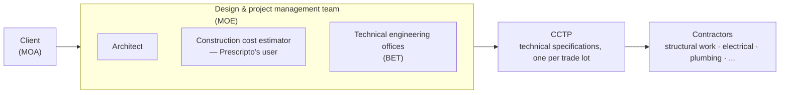
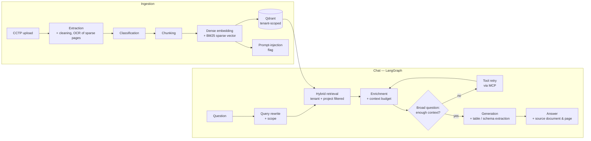

# Prescripto

Prescripto is an intelligent document management system built for construction
cost estimators working with CCTP files — technical specification documents
that routinely run several hundred pages and cross-reference technical
standards.

Finding one specific requirement — a material thickness, a classification, a
regulatory reference — usually means reading through documents that nothing
indexes by meaning. Prescripto replaces that search: ask in natural language,
get an answer sourced to the exact document and page it came from. Upload a
project's technical documents, query the corpus conversationally, and generate
a structured technical summary of the project.

It is not a document search engine — it is a RAG-based technical assistant,
tenant-scoped to each firm.

## Domain context

On a French construction project, the client — known as the **maîtrise
d'ouvrage (MOA)** — commissions a design and construction management team,
the **maîtrise d'œuvre (MOE)**: the architect, the technical engineering
offices (**BET**), and the construction cost estimator (**économiste de la
construction**), who owns cost estimation, quantity surveying, and technical
compliance across the whole project.


```mermaid
flowchart LR
    MOA["Client\n(MOA)"] --> MOE

    subgraph MOE["Design & project management team\n(MOE)"]
        ARCH["Architect"]
        ECO["Construction cost estimator\n— Prescripto's user"]
        BET["Technical engineering offices\n(BET)"]
    end

    MOE --> CCTP["CCTP\ntechnical specifications, one per trade lot"]
    CCTP --> ENT["Contractors\nstructural work · electrical · plumbing · ..."]
```

For every trade lot (earthworks, structural work, electrical, plumbing, ...)
the MOE writes a **CCTP** (*Cahier des Clauses Techniques Particulières* —
particular technical specifications): a document listing the exact materials,
execution methods, and standards (DTU, NF, Eurocodes, ...) the contracting
company must comply with. A mid-size project easily produces several hundred
pages of CCTP spread across dozens of lots, all cross-referencing each other
and the general standards.

The estimator's daily work is reading and cross-checking that corpus: pricing
it, verifying a requirement is actually met, tracing a spec back to its source
document. Prescripto is built for that job — one tenant per firm (a
construction cost consultancy, **cabinet d'économie de la construction**),
each project's CCTP corpus ingested and queryable in natural language, every
answer traceable to its source document and page.

## How it works


```mermaid
flowchart LR
    subgraph Ingestion
        A[CCTP upload] --> B["Extraction\n+ cleaning, OCR of sparse pages"]
        B --> C[Classification]
        C --> D[Chunking]
        D --> E["Dense embedding\n+ BM25 sparse vector"]
        E --> F[("Qdrant\ntenant-scoped")]
        E --> X["Prompt-injection\nflag"]
    end

    subgraph Chat["Chat — LangGraph"]
        Q["Question"] --> RW["Query rewrite\n+ scope"]
        RW --> R["Hybrid retrieval\ntenant + project filtered"]
        F --> R
        R --> EN["Enrichment\n+ context budget"]
        EN --> J{"Broad question:\nenough context?"}
        J -->|no| T["Tool retry\nvia MCP"]
        T --> EN
        J -->|yes| G["Generation\n+ table / schema extraction"]
        G --> S["Answer\n+ source document & page"]
    end
```

- **Ingestion.** Each uploaded document is extracted, cleaned (tables of
  contents, repeated headers and footers removed, near-empty pages OCR'd),
  classified, chunked, and indexed in Qdrant with a dense `mistral-embed`
  vector and a BM25 sparse vector. Passages that look like prompt-injection
  attempts are flagged at this stage.
- **Chat.** The question runs through a LangGraph graph: a rewrite into a
  search query, hybrid retrieval (dense + BM25, fused) filtered by tenant and
  project, context assembly, then a streamed Mistral answer over SSE. A
  requested table or technical schema is extracted in parallel with the
  answer. For broad questions, a judge checks whether the retrieved context
  is sufficient and, if not, the agent searches again with tools before
  answering.
- **Summary.** Each project can produce a structured technical summary
  extracted from its ingested corpus.

## Key features

- **Answers traceable to the source** — every answer lists the documents and
  pages it was built from.
- **Hybrid search** — dense embeddings and BM25 keyword vectors, fused, so a
  query matches on exact references (norm numbers, article codes) as well as
  on meaning.
- **Sourced norms only** — the generation prompt only lets the model cite a
  standard (DTU, NF, Eurocode) that appears in the retrieved context.
- **Multi-tenant by construction** — every SQL query and every vector search
  filters by `tenant_id`.
- **Model routing** — `mistral-large` for the rewrite and the answer,
  `mistral-small` for the lighter judging steps, with per-prompt cache keys.
- **MCP server** — the corpus is exposed as read-only tools to any MCP client.
- **Prompt-injection defences** — retrieved text is framed as data, never as
  instructions, and suspicious passages are flagged and surfaced as warnings.
- **Observable** — LangSmith tracing of the graph, and one structured JSON log
  record per question with per-step timings.

## MCP server

The backend exposes an [MCP](https://modelcontextprotocol.io) server on `/mcp`
with two read-only tools, `search_documents` and `read_passage`. The same
tools serve two consumers: an external MCP client (Claude Code, Claude
Desktop, Cursor…) authenticated with a Prescripto access token, and the chat
agent itself, which calls them through an in-memory session when a broad
question needs a second search.

Identity comes only from the token, never from a tool argument: a client sees
the projects of its own tenant and nothing else.

```bash
claude mcp add --transport http prescripto http://localhost:8000/mcp \
  --header "Authorization: Bearer <access token>"
```

Security model, tool signatures and injection defences:
[`docs/architecture/mcp.md`](./docs/architecture/mcp.md).

## Tech stack

| Layer | Technology |
| --- | --- |
| Frontend | React 19 + TypeScript (strict) + Vite 7, Tailwind CSS v4 |
| Frontend data/state | TanStack Query v5, Zustand v5, React Router v7, React Hook Form v7, Zod v4 |
| Frontend tests | Vitest + Testing Library, Playwright (E2E) |
| Backend | FastAPI (Python 3.12), REST + SSE, `uv` |
| Orchestration | LangGraph (chat graph), LangSmith (tracing) |
| Backend data | SQLAlchemy 2.0 (async) + Alembic, Pydantic v2 |
| Auth | JWT (bcrypt + python-jose), no third-party auth service |
| Backend tests | pytest + pytest-asyncio, Ruff |
| Relational store | PostgreSQL 16 — every table isolated by `tenant_id` |
| Vector store | Qdrant — dense + BM25 sparse vectors, tenant filter on every query |
| LLM | Mistral — `mistral-large-latest` (rewrite, generation), `mistral-small` (judge, reformulation), `mistral-embed` (1024 dim) |
| Tool protocol | MCP (FastMCP, streamable HTTP) |
| Hosting | AWS `eu-west-3` — ECS Fargate behind an ALB + WAF, RDS, Qdrant Cloud; client on Vercel |
| CI | GitHub Actions — hosted runners, plus a self-hosted runner for the eval gate |

## Quality gates

`main` is protected by four required checks, with no bypass:

- **`client`** — typecheck, lint with zero warnings, tests with a coverage
  floor, build, dependency audit.
- **`backend`** — pytest with a coverage floor, Ruff.
- **`guard`** and **`eval`** — a retrieval-recall measurement over a fixed
  question set on a real indexed corpus, compared against a stored reference.
  A pull request that degrades retrieval turns `eval` red and cannot be merged,
  even when every unit test passes.

Details, including how the self-hosted runner is locked down on a public
repository: [`docs/architecture/ci.md`](./docs/architecture/ci.md).

## Project structure

```
client/src/
├── features/         # domain features — own their types, services, hooks, UI
│   ├── admin/
│   ├── auth/
│   ├── chat/
│   ├── landing/
│   ├── projects/
│   ├── settings/
│   └── summary/
├── components/       # shared, feature-agnostic UI (feedback, layout, primitives)
├── hooks/ lib/ stores/ types/ config/   # shared leaf code — never import a feature
├── pages/ routes/ providers/            # composition and wiring
└── test/

backend/app/
├── api/              # HTTP layer only — routing, validation, status codes
│   auth · projects · folders · documents · chat · search · summary · admin · mcp
├── services/         # business logic — the only layer touching models/ and external clients
│   ├── ingestion/    # extraction -> cleaning -> classification -> chunking -> embedding
│   ├── chat/         # the LangGraph graph (graph.py), rewrite, context, judge, tool retry
│   ├── search · sparse            # hybrid retrieval, BM25 sparse vectors
│   ├── mcp_server · mcp_tools     # the MCP server and its two tools
│   ├── injection_guard            # prompt-injection detection
│   └── auth · project · folder · document · summary · email · admin
├── models/           # SQLAlchemy ORM — tenant, user, project, folder, document, chunk, conversation, message, summary
├── schemas/          # Pydantic request/response models
└── core/             # config, auth, DB session, external clients (Qdrant, Mistral), rate limits, tracing

shared/schemas/       # Zod schemas shared between client and backend contracts
.github/workflows/    # ci.yml (deterministic gates) · eval.yml (retrieval-recall gate)
```

Architectural rules: `api/` never queries the database or calls an external
client directly — that belongs to `services/`, the only layer allowed to touch
Qdrant or Mistral. Every SQL query and every vector search filters by
`tenant_id`; there is no database-level isolation (no RLS), so this filter is
the entire multi-tenancy boundary.

For a deeper, code-grounded walkthrough of each part of the system — auth and
tenant isolation, the ingestion pipeline, the chat graph, the MCP server, the
data model, the frontend, deployment and CI — see
[`docs/architecture/overview.md`](./docs/architecture/overview.md).

## Getting started

See [`SETUP.md`](./SETUP.md) for full local setup (Docker stack, environment
variables, migrations). Quick reference:

```bash
docker compose -f docker-compose.dev.yml up -d   # Postgres, Qdrant, pgAdmin
pnpm dev:backend                                  # FastAPI, :8000
pnpm dev                                          # React client, :5173
```

## License

MIT — see [`LICENSE`](./LICENSE).
