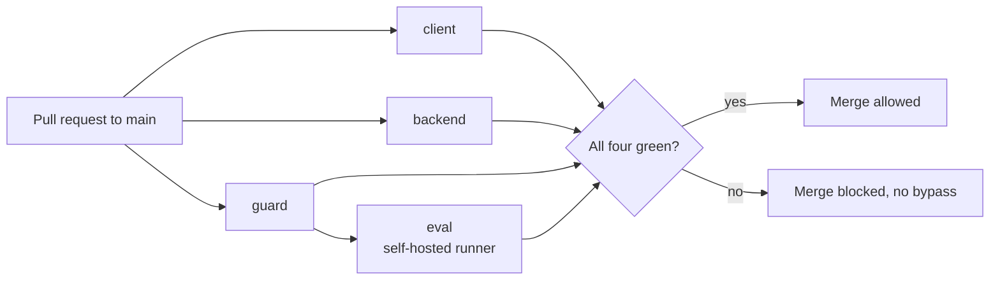

# Continuous integration

Two GitHub Actions workflows guard `main`: `.github/workflows/ci.yml`
(deterministic gates, hosted runners) and `.github/workflows/eval.yml` (a
retrieval-recall gate on a self-hosted runner). Together they produce four
checks - `client`, `backend`, `guard`, `eval` - and all four are required to
merge. The same gates run locally first; CI is the server-side mirror.

## `ci.yml`

Runs on pushes to the main and development branches, on every pull request, and
on manual dispatch. Permissions are `contents: read`; a `concurrency` group cancels a
superseded run on the same ref. No job uses a model, a network service or a
secret.

### Job `client`

Node 22, pnpm with `--frozen-lockfile`. Steps, in order:

1. **Typecheck** - `tsc --noEmit`.
2. **Lint** - `eslint src e2e --max-warnings=0`: a warning fails the job.
3. **Test** - `vitest run` (run-once, so the test role does not depend on the
   coverage provider).
4. **Coverage floor** - `vitest run --coverage`. The thresholds are in
   `client/vitest.config.ts`: lines 90, functions 90, branches 85. The measured
   surface is the explicit `coverage.include` list (services, mappers, schemas,
   error/result spine, pure utils, stores and a set of components), not every
   file.
5. **Build** - `pnpm build` (`tsc && vite build`).
6. **Dependency audit** - `pnpm audit --audit-level=high`. A finding with no
   published fix is recorded with a reason in the pnpm audit configuration, never
   by lowering the level.
7. **Bundle secrets** - greps `client/src` for `VITE_*` variable names that look
   like secrets (`SECRET`, `PRIVATE`, `PASSWORD`, `TOKEN`, `_KEY`, ...), since
   anything `VITE_`-prefixed ships in the public bundle. Public-by-design names
   (`ANON`, `PUBLIC`, `PUBLISHABLE` keys) are allowed. The step fails if the
   scan could not run.

### Job `backend`

Python 3.12 through `uv` (`uv sync --extra dev --frozen`), working directory
`backend/`:

1. **Test** - `python -m pytest`. Coverage options come from `addopts` in
   `backend/pyproject.toml`: `--cov=app --cov-fail-under=78`. The enforced floor
   is **78 percent** overall, the measured coverage rounded down; the 85 percent
   figure in the backend rules is the target, not what the gate checks today. `tests/conftest.py` provides
   placeholder settings, so nothing reaches Postgres, Qdrant or Mistral.
2. **Lint** - `ruff check .`
3. **Format** - `ruff format --check app/` (scoped to `app/` on purpose: the
   frozen test tree is never reformatted).
4. **Eval gate tests, lint, stdlib check** - the verdict script
   `scripts/eval_gate.py` has its own tests (`scripts/tests`), is linted, and
   `python3 -I scripts/eval_gate.py selfcheck` proves it imports with the
   standard library alone, because the self-hosted runner executes it with a bare
   interpreter.

Type checking and Python dependency audit have no tool configured yet and are
not claimed.

## `eval.yml` - the retrieval-recall gate

Runs on pull requests to `main` and on manual dispatch.

### What it measures

A fixed set of questions is run through the real retrieval path against an
indexed corpus. For each question the harness records the rank of the expected
passage. `scripts/eval_gate.py` turns ranks into two counts: `hit@5` and `hit@15`
(questions whose expected passage ranks within the top 5 and top 15). The current
measure is compared with a stored reference, with **zero tolerance**: any drop in
either count fails, and the summary lists the question ids that were lost.

The measure carries a content fingerprint of the corpus and question set. If the
fingerprint or the question set differs from the reference, the gate fails with
"reference stale" rather than comparing unlike things. A reference is refreshed
deliberately, never automatically.

Nothing from the corpus can reach the log. The measure is a list of question ids,
integer ranks and a hex digest; `eval_gate.py` refuses anything else, and it is the
only step that prints to the public log and job summary. Measurement output
(`uv`, harness, warnings) goes to a local run directory, with stderr closed first
so a failing command cannot print a path.

### Jobs

- **`guard`** (hosted runner, no checkout, so no pull-request code runs): fails
  when the event is a pull request from a fork. Manual dispatch and same-repo
  pull requests pass.
- **`eval`** (`needs: guard`, runs only for dispatch or same-repo branches, on a
  runner labelled `self-hosted` with an eval label): checks out with a pinned
  commit of `actions/checkout` and no persisted credentials, runs the measurement
  with `RETRIEVAL_MODE=v1`, then `eval_gate.py check` compares against the
  reference and writes the summary table (reference, current, delta per metric).
  Both jobs are required: an `eval` skipped by its `if` would count as success,
  so `guard` is required alongside it.

### Why self-hosted, and why that is dangerous

The measurement needs a real indexed corpus (confidential customer specs that
cannot live on a hosted runner or in the repo) and a Mistral API key. So the job
runs on a machine the owner controls.

On a public repository this is the sharpest edge in the pipeline: a pull request
can edit its own workflow file, and a job on a self-hosted runner executes with
whatever that machine can reach. The defences, in layers:

- **Fork pull requests need approval** - the repository requires approval for all
  external contributors, and fork runs are never approved while the runner is
  registered.
- **A job-started hook outside the repository.** The runner is configured with a
  job-started hook script, owned by root and stored outside any checkout, so a
  pull request cannot change it. The hook allows a job only if both hold: the
  triggering actor is on an allow-list kept in the runner's root-owned
  environment file, and the event is a manual dispatch or a pull request whose
  branch lives in this repository. Otherwise it exits non-zero and GitHub does
  not start the job. Its output is a single fixed line.
- **Least privilege.** The runner's binaries, configuration and environment are
  root-owned; the job's user can write only its work and diagnostics folders, and
  cannot read the owner's home directory or the corpus directly. The eval
  reference file is not writable by jobs.
- **A public log that can only print integers.** Only `eval_gate.py` writes to the
  log, and it validates its input as ids, integers and a hex digest.
- **`guard` is defence in depth only**, since a fork controls its own workflow
  file; the hook is the real barrier.

The runner is kept offline from developer servers: it is stopped while local dev
servers run, because those expose local-only shortcuts.

## Branch protection

A repository ruleset on `main` requires the four checks (`client`, `backend`,
`guard`, `eval`), requires changes to arrive through a pull request, forbids
deletion and force-push, and has **no bypass actors**: a red check disables the
merge button for the owner as well.

## Demonstrated behaviour

The gate was proved against a deliberate regression: a pull request lowered the
default retrieval search limit in `backend/app/core/config.py` and its test. The
`client`, `backend` and `guard` checks stayed green, and only `eval` went red,
reporting a lost question under `hit@15`. The pull request was closed unmerged.
That is the intended separation: the hosted gates say the code is correct, and
`eval` alone says retrieval has not regressed.
