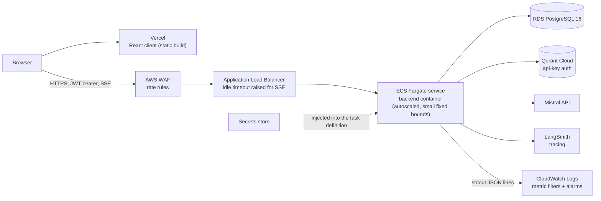

# Deployment

Prescripto runs on AWS in `eu-west-3` (Paris), with the client on Vercel and the
vector store on Qdrant Cloud. This document describes the topology and the
guards in the code that make a deployed instance refuse to start misconfigured.
It describes shape, not identifiers: nothing here names an account, a resource
or a secret.

## Topology

| Piece | Role |
| --- | --- |
| Vercel | Serves the static React build. The API origin is baked in at build time through `VITE_API_URL` (`client/src/lib/apiClient.ts`). |
| AWS WAF | In front of the load balancer; rate-based rules throttle abusive sources before they reach the application. |
| ALB | Terminates TLS and forwards to the Fargate tasks. Health checks hit `GET /api/health` (`backend/app/main.py`). |
| ECS Fargate | Runs the backend container, scaled between a small minimum and maximum number of tasks. |
| RDS | PostgreSQL 16, reached through `DATABASE_URL` (asyncpg). |
| Qdrant Cloud | The vector store; every request carries an API key. |
| CloudWatch | Receives container stdout, metric filters and alarms. |

## The container

`backend/Dockerfile` is a two-stage build:

- **Builder** (`python:3.12-slim`): copies `uv` in, installs build tools, then
  runs `uv sync --locked --no-dev` twice - dependencies first from
  `pyproject.toml` and `uv.lock` (so the layer is cached across code changes),
  then the project itself. Bytecode is compiled at install time.
- **Runtime** (`python:3.12-slim`): no compiler and no `uv`. It copies only the
  resulting `.venv`, `app/`, `alembic/` and `alembic.ini`, creates a
  system user and group, and runs as that non-root user. The entrypoint is
  `uvicorn app.main:app` on port 8000.

The image carries the Alembic revisions, but the `CMD` starts only the API:
migrations are not run implicitly on container start. Schema changes are applied
with an explicit, manual `alembic upgrade head` against RDS, so a booting replica
never runs a migration on its own.

## Why the load balancer idle timeout matters

Chat answers and project summaries are streamed as Server-Sent Events
(`backend/app/api/chat.py`, `backend/app/api/summary.py`, both
`text/event-stream` with `X-Accel-Buffering: no`). An SSE response is one long
HTTP request. A load balancer closes any connection that stays silent longer
than its idle timeout, and its default is short relative to a retrieval, judge
and generation pipeline that can pause between events. The code does not emit
periodic keep-alive frames, so the ALB idle timeout is raised above the longest
silent gap a stream can have; otherwise the client sees a truncated answer with
no server-side error.

## Configuration and secrets

Settings are plain environment variables read by `Settings` in
`backend/app/core/config.py`. In AWS they are injected into the ECS task
definition from a managed secrets store (database URL, JWT signing key, Qdrant
and Mistral keys, LangSmith key, and so on), so no secret is baked into the
image or committed. Non-secret flags (`ENVIRONMENT`, `CORS_ORIGINS`,
`FORWARDED_ALLOW_IPS`, `MCP_ALLOWED_HOSTS`) are set the same way.

### The production lock-down

`environment` defaults to `production`, so a missing variable can never open the
API. Only `ENVIRONMENT=local` unlocks developer shortcuts (`dev_mode`): the auth
bypass and the dev data seeding in `main.py`. Outside local, `Settings()`
refuses to be built - and the container therefore refuses to boot - when:

| Check | Why |
| --- | --- |
| `JWT_SECRET_KEY` is a known placeholder or shorter than 32 characters | a fallback secret would be a published secret |
| `DATABASE_URL` still contains `localhost` | the local compose default must not reach production |
| `QDRANT_API_KEY` is empty | Qdrant Cloud would only fail at the first real search, not at boot |
| `CORS_ORIGINS` is empty or contains `*` | the origin list must be explicit |
| `LANGSMITH_TRACING` is on without a `LANGSMITH_API_KEY` | tracing would fail silently at the first call |
| `FORWARDED_ALLOW_IPS` is empty, `*`, a `/0` network, or loopback | see below |

The last row exists because rate limiting keys on the client address. uvicorn
honours `X-Forwarded-For` only from the addresses in `FORWARDED_ALLOW_IPS`; it
must name the proxy that reaches the container. Left at the default, every
visitor would share the proxy's address and the first burst would lock everyone
out; set to `*`, a caller could write their own rate-limit key.

The in-process fixed-window limiter (`backend/app/core/ratelimit.py`) counts per
process, so with several tasks the effective per-client limit is multiplied by
the task count. The WAF rate rules are the coarse, shared layer in front of it.

The `/mcp` transport rejects any `Host` header not in `MCP_ALLOWED_HOSTS`
(DNS-rebinding protection); the public API hostname must be listed there.

## Observability

- **Tracing.** LangSmith tracing is active in production (`langsmith_tracing`
  in `config.py`), for the LangGraph chat pipeline.
- **Per-question log.** Each served question writes one bare JSON line to stdout
  with `event: "chat_question"` (`backend/app/services/chat/question_log.py`,
  `backend/app/core/log_config.py`). The record is built from a whitelist of
  state keys - ids, flags, token counts and timings - and never contains the
  question, the rewrite, the retrieved context or the answer. The logger does not
  propagate, so no prefixed duplicate breaks parsing.
- **CloudWatch.** Container stdout lands in CloudWatch Logs. Logs Insights
  queries read the `chat_question` records. Two metric filters over the same
  records (per-question latency and per-question cost) feed CloudWatch alarms
  that notify by e-mail through SNS, so a drift is signalled without anyone
  reading logs.

## Not in scope

No infrastructure-as-code: the AWS resources are provisioned in the console.
No Kubernetes: ECS Fargate is the only orchestrator.
