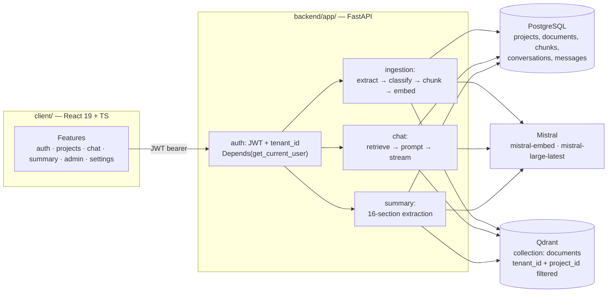

# Architecture overview

This is the entry point into the docs below — each one is grounded in the
actual code (file paths, real snippets), not the intended design.

- [`auth-and-tenancy.md`](./auth-and-tenancy.md) — JWT, bcrypt, the
  `tenant_id` isolation discipline, the local-only dev auth bypass.
- [`ingestion-pipeline.md`](./ingestion-pipeline.md) — upload → extraction →
  classification → chunking → embedding → Qdrant.
- [`rag-chat.md`](./rag-chat.md) — retrieval, prompt construction, streamed
  generation, source traceability.
- [`data-model.md`](./data-model.md) — the Postgres schema, the FK graph,
  the project-summary feature.
- [`frontend.md`](./frontend.md) — feature-slice layout, the service/hook
  boundary, SSE consumption on the client side.

## System diagram

## Where the code diverges from the original design

`docs/architecture-rag.md` was written before the RAG pipeline existed, as
a design proposal. It's kept as-is for the historical record, but three of
its ideas were never built — worth knowing before reading it as current
truth:

| Proposed | Actual state |
| --- | --- |
| Cross-encoder re-ranking of retrieved chunks | Not implemented — ranking is Qdrant cosine similarity plus a couple of hand-written score penalties (see [`rag-chat.md`](./rag-chat.md#retrieval)) |
| A tenant-wide "global search" mode across projects | Not implemented — every search is project-scoped (see [`rag-chat.md`](./rag-chat.md#scope-honestly)) |
| Per-chunk `date` metadata | Not extracted — only an `ingested_at` timestamp exists |

Two smaller, structural gaps worth knowing if you're extending this system:

- **Tenant isolation below `Project` is transitive, not direct.** Only
  `User` and `Project` carry a `tenant_id` column; `Document`, `Chunk`,
  `Conversation`, and `Message` are isolated by joining through
  `project_id`, not by a column of their own (see
  [`data-model.md`](./data-model.md#isolation-direct-vs-inherited)).
- **`shared/schemas/` is currently empty.** Zod contracts that are meant to
  be shared between client and backend are, today, feature-local on the
  client side instead (see
  [`frontend.md`](./frontend.md#shared-schemas--current-state)).

Neither is a defect by itself — the `tenant_id` filter is still applied at
every query site, just via a join instead of a column — but both are the
kind of thing that gets harder to keep correct as the system grows, and
worth fixing before it does.
