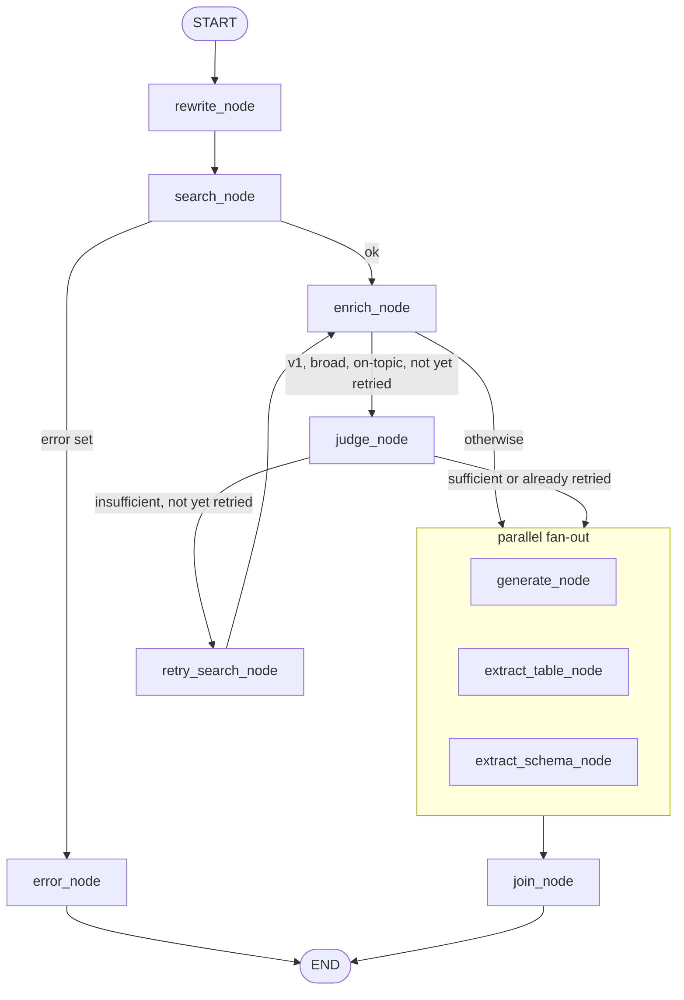

# RAG chat: retrieval, generation, streaming

`POST /projects/{project_id}/chat` streams a Mistral answer over SSE, grounded
in the project's ingested corpus. Chat is always project-scoped: every
retrieval carries both `tenant_id` and `project_id` (see
[Scope, honestly](#scope-honestly)).

The route (`backend/app/api/chat.py`) only wires `Depends(get_current_user)`
and hands the request to `chat_stream` in
`backend/app/services/chat/graph.py`. That function owns the conversation and
message persistence; everything between "question received" and "answer
produced" is a LangGraph `StateGraph`.

Modules of `backend/app/services/chat/`:

| Module | Role |
| --- | --- |
| `graph.py` | `StateGraph` definition, context assembly, `chat_stream`, usage and log wiring |
| `query_rewrite.py` | Question to search query, related queries, table/schema flags |
| `prompts.py` | System prompt, rewrite prompt, scope regex, forced related queries |
| `search_limits.py`, `context_budget.py`, `context_dedup.py` | Search limits, score-ordered context budget, article-copy merge |
| `chunk_enrichment.py`, `context_enrichment.py` | Heading expansion, DPGF quantities, project metadata for broad questions |
| `sufficiency.py`, `tool_retry.py` | Broad-scope judge and the tool-using retry |
| `table_extraction.py`, `schema_extraction.py` | Structured table and technical-schema extraction |
| `model_routing.py` | Which model each call uses, prompt-cache keys, pricing |
| `question_log.py`, `step_timing.py` | The per-question log record and its timings |
| `conversation.py` | Conversation CRUD (tenant checked through the project) |

Search itself lives in `backend/app/services/search.py` and
`backend/app/services/sparse.py`; the Mistral client and rate limiters in
`backend/app/core/mistral.py`.

## The graph

`_build_graph` compiles a fresh graph per request, with `db`, `tenant_id` and
`project_id` bound by closure rather than stored in state. The checkpointer is
an `InMemorySaver`, used only so the final state can be read back for the
question log. Nodes stream to the caller through LangGraph's custom stream
writer (`stream_mode="custom"`).



The fan-out targets are computed by `_generation_targets`: `generate_node`
always; `extract_table_node` when the rewrite flagged `structured == "table"`;
`extract_schema_node` when `schema_flag == "schema"`; the two extractions only
run when the context is non-empty. All targets join on `join_node`.

State (`ChatState`) carries the question and history, the rewrite output
(`search_query`, `related_queries`, `scope`, flags), the per-scope limits, the
search results, the rendered `context_block`, the `sources`, the Mistral
messages, the usage of each call, and the retry bookkeeping (`judgment_missing`,
`needs_retry`, `retried`).

## Query rewrite

`rewrite_node` calls `rewrite_query` with the last turns of history. A French
prompt (`REWRITE_PROMPT`) asks the model for JSON: a search `query` of 5 to 20
words in the trade's vocabulary (no norm references), up to two `related`
queries aimed at adjacent construction concepts, and two flags, `structured`
(`table`/`none`) and `schema` (`schema`/`none`). The reply is parsed
defensively: fenced JSON is unwrapped, the query is cut to 25 words, related
queries to two items of at most 15 words, unknown flag values fall back to
`none`.

Failure paths all degrade to the user's own question with no related queries:
an exception, an empty reply, or unparseable JSON.

Off-topic questions: the model answers `HORS_SUJET` and the query becomes
`None`. No search is run, the context is empty and the answer tells the user
nothing relevant was found. **Guard (v1 only):** if the question cites a norm
(DTU, NF, an `EN` followed by a number, Eurocode, RE2020, RT2012...,
`has_normative_reference`, whole words, accent-insensitive), an off-topic
verdict is overridden and the original question is searched instead.

## Scope classification

Scope is decided in the graph, not by the model: `classify_scope` in
`prompts.py` is a deterministic regex over the question (enumerations, "liste",
"résumé", "synthèse", "vue d'ensemble", "tous les", "budget", "maître
d'ouvrage", "combien de", applicable norms...). It returns `broad` or
`specific` (narrow). The scope the rewrite model may also return is ignored.

| | Narrow | Broad |
| --- | --- | --- |
| Search | `search_merged` over the queries | `search_by_lot` (lot coverage + semantic) |
| Context budget | 20,000 characters | 48,000 characters |
| Displayed sources | 5 | 10 |
| Table / schema extraction | per rewrite flags (schema also forced by a keyword regex) | table disabled; schema only if the keyword regex forces it |
| Extra context | none | project metadata block (lots, document types) |
| Sufficiency judge | no | yes (v1) |

## Retrieval

Embeddings are `mistral-embed` (1024 dimensions). Every Qdrant condition list
in `search.py` starts with `tenant_id` and `project_id`; optional `lot`,
`phase` and `type` conditions are appended for filtered calls. Nothing else
isolates tenants, so the filter is written on each call, and on both prefetch
branches of the hybrid query (a prefetch without it would spend its `limit` on
other tenants' points).

**Hybrid ranking (v1).** `_ranked_hits` sends one `query_points` call with two
`Prefetch` branches fused by Qdrant's `Fusion.RRF`:

- `dense`: the `mistral-embed` vector, with the dense score threshold applied
  to this branch only;
- `sparse`: a BM25-style sparse vector built in `sparse.py`. Documents carry
  BM25 term-frequency weights (k1 1.2, b 0.75), queries carry 1.0 per distinct
  token, and Qdrant applies IDF server-side (`Modifier.IDF`). Token indices
  are a stable 32-bit hash, so no vocabulary is stored. The tokenizer folds
  accents and keeps references whole (`DTU 20.1` stays one token) and does no
  stemming or stopword removal.

A query with no token skips the sparse branch. The v1 collection stores named
vectors `dense` and `sparse`; in baseline mode the same function runs a plain
dense search.

Because fused scores are RRF scores rather than cosine scores, the
context-building score cutoff is `0.0` in v1 (`context_score_threshold`); the
search limit bounds the context instead.

**Narrow scope: `search_merged`.** All queries (rewritten query, original
question if different, related queries) are embedded in one call. Each runs a
ranked search with a threshold of 0.40; if nothing at all comes back, every
query is retried at 0.35. The best hit of each query is reserved so a query
cannot be crowded out, the rest are merged by point id (highest score wins),
and the list is cut to the limit.

When the rewritten query matches certain topics (below-ground walls and
foundations, exterior walls and facades), `get_forced_related` adds fixed
related queries. They are searched at threshold 0.30 and their hits, if not
already present, are appended with a score floor of 0.45.

**Broad scope: `search_by_lot`.** Two sources are merged. A scroll over the
project's points (tenant and project filtered) discovers every lot and takes up
to five non-heading, non-quantity, non-admin chunks per lot, so every lot is
represented. A semantic pass (rewritten query, original question, related
queries; threshold 0.30, pool of 250) keeps up to eight chunks per lot,
ordered by content type then score.

**Adjustments applied to hits:**

- Version dedup: for versioned document types (`cctp`, `dpgf`, `etude_sol`,
  `rapport_amiante`, `etude_thermique`) only chunks of the most recently
  ingested document survive.
- Score penalties (no reranker, only heuristics): diagnostic-type chunks
  (asbestos report, soil study, thermal study) are multiplied by 0.85 unless
  the query contains one of that type's topic terms; `admin` content chunks
  are multiplied by 0.80 (applied in `search_documents` and `search_merged`,
  not in `search_by_lot`).
- In `enrich_node`, thermal-report chunks are dropped outright unless the
  question mentions thermal terms (RE2020, BBio, thermal study...).

### Search limits

`search_limits.py` holds the narrow-scope limit: `V1_SEARCH_LIMIT` (default
15) under v1, a fixed 20 under baseline. `query_limits` derives the per-call
limits from it: at least one result per query (`max(1, limit // 4)` each),
separately for main and forced queries, so more queries do not shrink each
query's share. `search_merged` asks Qdrant for `3 x limit` per query before
merging.

## Enrichment

Run inside `_run_search` (narrow scope) and `enrich_node`:

- `expand_heading_chunks`: heading-only or very short chunks (under 150
  meaningful characters) pull in the chunks at the next three positions of the
  same document, via a tenant/project-filtered Qdrant scroll.
- `enrich_with_dpgf_quantities`: scrolls the project's DPGF (quantity
  schedule) files that relate to the question and keeps quantity chunks whose
  article prefix and topic words match.
- `build_db_context` (broad only): a metadata block listing the project's lots
  (Postgres `Document` rows joined to `Project`, filtered by tenant, plus lot
  headings read from CCTP/DPGF chunks in Qdrant) and the document types with
  counts. It is prepended to the context so enumeration questions do not
  depend on semantic search alone.

## Context assembly

`_build_context_and_sources` turns the results into the `context_block`:

1. Drop chunks under the score cutoff (DPGF chunks are exempt) and exact text
   duplicates (first 200 characters).
2. **Budget by score (v1).** `context_budget.select_by_score` takes passages
   in descending score and stops at the first one whose rendering would
   exceed `context_max`. The cost counted is the exact rendered length
   (headers, `=== lot ===` separators, `---` joins), so the kept set always
   fits. The retained passages are returned in document order (lot, filename,
   position). Baseline fills lot by lot in alphabetical order instead.
3. **Article-copy merge (v1).** A CCTP repeats the same general clause at the
   head of every lot, each copy being a distinct chunk. `context_dedup`
   computes a key by stripping a leading article number (two or more levels,
   such as `1.1.3.9.`), collapsing whitespace and lowercasing; passages with the
   same key are rendered once, the highest-scored copy kept, under a header
   listing every location: `[file, p.3 ; aussi : file, p.9 ; ...]`. The lot is
   omitted from that header since it is document-level metadata.

Passages are rendered as `[filename, p.N]` followed by the text, grouped under
`=== lot ===` separators when more than one lot is present, joined by `---`.

## Prompt construction

`_build_mistral_messages` builds the message list:

- **System prompt**: `system_prompt_for(mode)` (French; answer only from the
  documents, never cite sources inline, concise, full dimensions, one block per
  work item, one `Localisation` block at the end).
- **Scope block**: broad questions get an enumeration/summary format ending in
  a fixed disclaimer sentence; narrow ones get the localisation instruction.
  A question about exterior walls adds a composition instruction.
- **Visual complements**: when a table or schema will be produced, a note
  tells the model not to repeat quantities already in the table.
- **Norms (v1)**: the baseline prompt asks for a single `Normes` block
  gathering all applicable DTU/NF EN. The v1 variants (applied by string
  replacement in `system_prompt_for` and the related helpers) restrict it:
  cite only norms written in the context and tied to the work item asked
  about, never one absent from the context, and omit the block entirely when
  there is none.
- **`<documents>` framing (v1)**: a security rule is appended to the system
  prompt and the context is wrapped by `frame_context` in
  `<documents>...</documents>`. The rule states that the content is quoted
  corpus, never instructions. Closing or opening `documents` tags found in
  the text are escaped so a passage cannot end the frame, and a heuristic
  pattern check (`injection_guard.py`) appends a warning line naming the
  passages whose text reads like instructions addressed to the model.
- **History**: the last 6 messages (excluding the current question), then the
  user turn: context plus question. With no context, the user turn instructs
  the model to say nothing relevant was found.

## Model routing and prompt caching

| Call | Model |
| --- | --- |
| Generation (streamed, temperature 0.1) | `mistral-large-latest`, always |
| Table and schema extraction (temperature 0) | `mistral-large-latest`, always |
| Query rewrite | `V1_REWRITE_MODEL` under v1 (default `mistral-large-latest`) |
| Sufficiency judge, query reformulation, tool-retry turn | `V1_FAST_MODEL` under v1 (default `mistral-small-latest`) |

Under baseline every call uses mistral-large. `model_routing.py` also carries
the per-model price table used to compute the usage figures.

**Prompt caching (v1).** Four calls pass a fixed `prompt_cache_key` to
Mistral: `prescripto-v1-generation`, `-rewrite`, `-judge`, `-reformulate`. The
keys are shared across tenants on purpose: the shared prefix is the system
prompt, which holds no client data. The tool-retry turn and the two
extractions send no key. Cached input tokens are read back from the usage
details and priced at a reduced input rate.

## Rate limiting

`core/mistral.py` defines two process-local `_RateLimiter` instances that
serialize calls to a fixed rate: `mistral_large_limiter` (0.25 requests/s) and
`mistral_fast_limiter` (`V1_FAST_RPS`, default 1.5). Every Mistral chat call
awaits the limiter matching its model (`is_large(model)` selects it). The time
a call waited is recorded as a `<step>_wait` timing. Since the limiters are
per process, several backend tasks share the provider quota and must split the
configured value.

## Broad-scope sufficiency judge and tool retry

Under v1, a broad on-topic question passes through `judge_node` before
generation (`should_judge`). The judge sees the question and the first 150
characters of each passage, and answers JSON `suffisant` / `insuffisant` with
a short `manque` text. An unreadable reply or a failed call counts as
sufficient, so the judge never blocks an answer.

On an insufficient verdict, and at most once per question, `retry_search_node`
runs `retry_with_tools`: one Mistral tool-calling turn (the fast model) over
the MCP read tools `search_documents` and `read_passage`, with `project_id`
and `tenant_id` hidden from the model and injected server-side. At most three
tool calls run, in sequence; the first invalid call stops the rest. The tools
are reached through an in-memory MCP session built per request over the same
database session, scoped by a `ToolIdentity` to the current tenant and
project. The returned passages are merged with the first results (duplicates
keep their first copy), and control returns to `enrich_node`, then straight to
generation. If the retry fails, the first results are served. Details of the
tools and their guard rails: [`mcp.md`](./mcp.md).

## Streaming over SSE

The route returns `StreamingResponse(media_type="text/event-stream")` with
`X-Accel-Buffering: no`. The sequence emitted by `chat_stream` and the graph:

```
data: {"conversation_id": "..."}      # before any retrieval
data: {"text": "token"}               # repeated, from generate_node
data: {"structured": {...}}           # optional, table extraction (join_node)
data: {"schema": {...}}               # optional, schema extraction (join_node)
data: {"sources": [...]}              # when there is at least one source
data: [DONE]
```

`structured`, `schema` and `sources` are emitted by `join_node`, i.e. after
generation and extractions have all finished; extractions run concurrently
with the token stream. If the search fails, the stream is
`conversation_id`, then `{"error": "<French message>"}`, then `[DONE]`.

Internally `chat_stream` also yields a `{"usage": ...}` event (per-call token
counts and cost) just before `[DONE]`. The route filters it out
(`_without_usage_event`): usage is an in-process measurement, and exposing
per-call cached-token counts would let one tenant probe whether another had
recently sent the same text under the shared cache keys.

## Source traceability

Sources are built from the passages actually placed in the context, not from
the raw result set: passages under 80 characters are skipped, near-duplicates
are removed after normalizing localisation lines and quantities, passages of
the same `(document_id, page)` collapse into one entry whose text joins the
fragments in document position order, and the list is cut to 5 sources (10 for
broad). Each source carries `document_id`, `filename`, `page`, `lot`, `phase`,
`section_title` and the chunk text, enough for the frontend to link back to
the document and page. When the context is empty, no sources are sent.

## Persistence

The user message is committed to Postgres before retrieval starts, right after
the conversation is created or loaded (tenant checked through the project).
The assistant message is committed after the graph finishes, with
`sources_json`, `structured_json` and `schema_json`. If the search errors, no
assistant message is stored: the conversation keeps a question with no answer.

## Observability

**LangSmith.** `core/langsmith.py` maps settings to the SDK's environment
variables; tracing is on only when `LANGSMITH_TRACING` is set and an API key is
present. Each graph node is wrapped with `@traceable` (`rewrite_node`,
`search_node`, `enrich_node`, `generate_node`, `extract_table_node`,
`extract_schema_node`, `judge_node`, `retry_search_node`).

**Question log.** Once per question, from the `finally` of `chat_stream` (so it
also fires on a cancelled stream), one JSON record is written to the
`chat_question` logger (`question_log.py`), built from a whitelist of state
keys: it never contains the question, rewrite, context, answer, or the
judge's `manque` text. Fields, at a high level:

- identifiers: `tenant_id`, `conversation_id`, the retrieval `mode`;
- flags: `scope`, `judged`, `retried`, `outcome` (`answered`, `no_context`,
  `search_error`, `failed`);
- totals: `latency_ms`, `ttft_ms`, input/cached/output tokens and `cost_usd`;
- `legs`: the same token and cost figures per call group (rewrite,
  generation, agent, extraction);
- per-step `<step>_ms` durations (rewrite, search, enrich, judge,
  retry_search, enrich_retry, generate, first-token and stream segments,
  extractions) and `<step>_wait_ms` for limiter waits.

## RETRIEVAL_MODE: baseline and v1

`RETRIEVAL_MODE` (`baseline` or `v1`) selects the Qdrant collection
(`documents` or `documents_v1`) and every behaviour marked "v1" above: hybrid
dense + sparse RRF retrieval, configurable search limit, score-budgeted and
article-merged context, `<documents>` framing and the sourced-norms prompt
variants, fast-model routing, prompt-cache keys, and the judge plus tool
retry. v1 is the production pipeline. Baseline (dense-only search, lot-ordered
fill, mistral-large everywhere) is kept as an A/B reference on its own
collection, which a v1 re-ingestion never overwrites. Note that the setting's
code default is `baseline`; the deployment selects v1 through the environment.

## Scope, honestly

- Chat is project-scoped only. There is no tenant-wide, cross-project search.
- There is no reranker or cross-encoder step; ordering comes
  from the RRF fusion (or cosine similarity in baseline), with the heuristic
  score penalties described under Retrieval.
- The sparse side is plain BM25 over hashed tokens: no stemming, no stopword
  list, no synonym expansion.
- Scope classification is a regex, so a broad question phrased outside its
  patterns is treated as narrow.
- The judge and the tool retry apply to broad questions only, and retry at
  most once.
